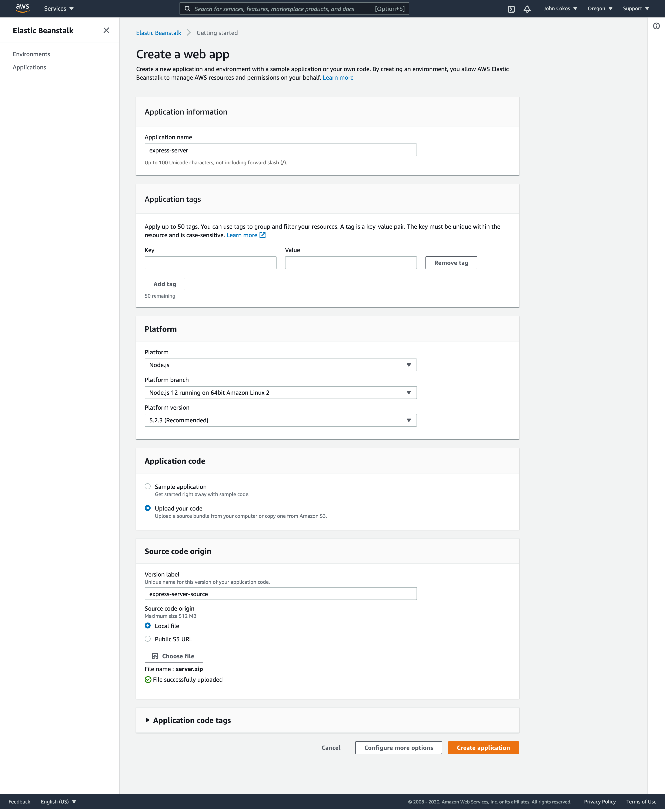
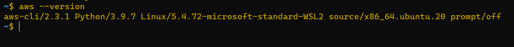
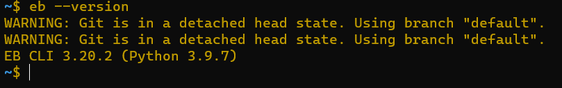

# cloud-server

## Because i dont have account on AWS so i couldn't deploy any application on it , here i will list the steps to do the deployements 
## and screen shoot of the installation for required dependencies 

### Creating an application with the Elastic Beanstalk GUI

- choose NodeJS as your platform
- Create and upload a .zip file with your application source code
  - Do not include node_modules or package-lock.
  
This will create your application and environment in one step, giving you a full GUI from where you can manage the app

## Creating an application using the command line only
First, ensure that you've installed the AWS CLI and the aws eb command line utilities.

1- eb init - Initializes your folder as an Elastic Beanstalk application

  -  Choose your region (us-west-2)

  -  Choose [Create new Application]

      - Note: If you already have an application, you could also choose that to connect
 - Answer the other questions as appropriate
     - Choose Node.js at the correct version

2-eb create my-environment-name - Create an "environment" for your app to reside in

3- eb deploy to deploy your new application to your new environment
 - You'll also use this whenever you make code changes
 

 ### You can then use some other eb commands to manage your apps::

- eb open to open your app in the browser
- eb list to get a list of apps
- eb ssh to ssh (login) to one of your apps
- eb health to get a health check on your environments

### The installation of AWS CLI Tools

### The installation of EB CLI Tools

